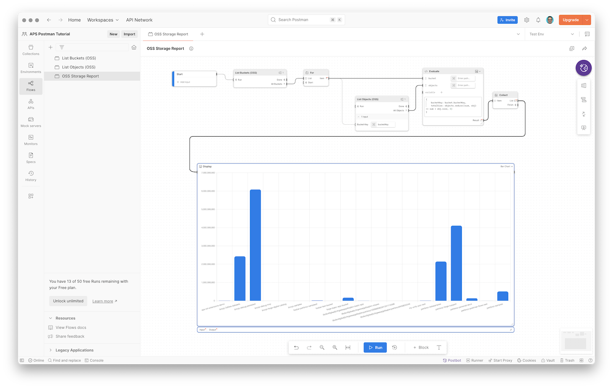

# Tutorial

This tutorial guides you through the process of building and using [Postman Flows](https://www.postman.com/product/flows/) with Autodesk Platform Services APIs. By the end of the tutorial, you'll have a fully functioning flow that outputs a bar chart with the total storage usage of your individual buckets in the [OSS (Object Storage Service) API](https://aps.autodesk.com/en/docs/data/v2/developers_guide/basics/#object-storage-service-oss).

## Prerequisites

In order to follow the tutorial you will need the following:

- [Postman](https://www.postman.com), incl. the ability to create flows and run them locally
    - For more details about usage limits and pricing, see https://learning.postman.com/docs/billing/flows-usage/
- Existing [APS application](https://get-started.aps.autodesk.com/#create-an-account)
