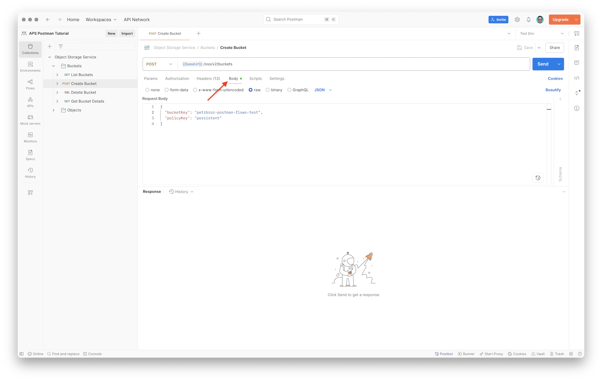
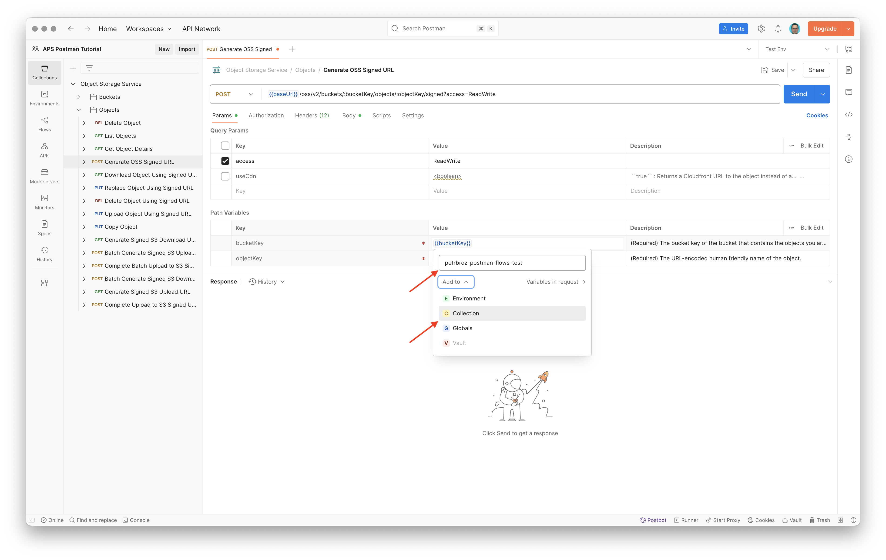

# Part 1: Setup

In this part of the tutorial we will prepare a collection of requests for the [OSS (Object Storage Service) API](https://aps.autodesk.com/en/docs/data/v2/developers_guide/basics/#object-storage-service-oss), setup the authorization, and test some of the requests.

## Import collection

Let's start by creating a collection of API requests we can later use when building Postman flows. We could build the requests by hand if we wanted to, however since there are now [official OpenAPI specifications](https://github.com/autodesk-platform-services/aps-sdk-openapi) available for many APIs in Autodesk Platform Services, including OSS, we can _import_ these specs into Postman instead.

- Open Postman
- In the left sidebar, switch to **Collections**, and click **Import**


- In the popup dialog, paste the URL to the OpenAPI specification of the OSS API:

```
https://raw.githubusercontent.com/autodesk-platform-services/aps-sdk-openapi/09dfeb71fab0daf032cf1b343ef3dcac8ba1800c/oss/oss.yaml
```

- In the **Choose how to import your Specification** dialog, keep **Postman Collection** selected, and click **View Import Settings**


- Configure the following import settings:
  - **Naming requests**: **Fallback**
  - **Set indent character**: up to you (we do not engage in the [Holy Wars of Tabs vs Spaces](https://wheresvic.gitlab.io/software-dawg/2018-08-01-the-holy-wars-tabs-vs-spaces-et-al.html) but spaces are of course the right answer 😊)
  - **Parameter generation**: **Schema**
  - **Folder organization**: **Tags**
  - **Include auth info in example requests**: **enabled**
  - **Enable optional parameters**: **disabled**
  - **Keep implicit headers**: **disabled**
  - **Include deprecated properties**: **disabled**
  - **Always inherit authentication**: **enabled**
- Click the left arrow at the top to go back


- Back in the **Choose how to import your Specification** dialog, click **Import** to generate the request collection in Postman
- After the collection has been imported, select it in the sidebar
- In the collection page, click on the **oss** title, and change it to `Object Storage Service`


- Finally, click the **Save** icon in the top-right to save the collection

## Create environment

Next we'll setup a Postman _environment_ with our application's credentials. By using environment variables, we can easily manage sensitive information and reuse values across multiple requests without hard-coding them in each request.

> Note: You can also create multiple environments, and reuse the same requests with different sets of inputs.

- In the left sidebar, switch to **Environments**, and click **Create Environment**


- In the environment page, change the name to `Test Env`, and add the following variables:
  - **Variable**: `APS_CLIENT_ID`
    - **Type**: **default**
    - **Initial value**: your APS client ID
  - **Variable**: `APS_CLIENT_SECRET`
    - **Type**: **secret**
    - **Initial value**: your APS client secret
- Click the **Save** icon at the top of the environment page to save it


- In the top-right corner, open the **No environment** dropdown, and select **Test Env** to _activate_ the new environment


## Setup authorization

With our application credentials defined in the environment, we can now setup the authorization for our API requests.

> Note: In Postman, authorization can be defined at different levels:
> - for individual requests
> - per-folder
> - per-collection
>
> In our case we will setup [2-Legged (aka Client Credentials) OAuth](https://aps.autodesk.com/en/docs/oauth/v2/tutorials/get-2-legged-token/) for the entire **Object Storage Service** collection.

- In the left sidebar, switch back to **Collections**, and select the **Object Storage Service** collection
- In the collection page, switch to the **Authorization** tab


- Set the following parameters:
  - **Auth Type**: **OAuth 2.0**
  - **Add auth data to**: keep **Request headers**
  - In the **Configure New Token** section:
    - **Token Name**: for example, `APS Client Credentials`
    - **Grant type**: **Client Credentials**
    - **Access Token URL**: `https://developer.api.autodesk.com/authentication/v2/token`
    - **Client ID**: `{{APS_CLIENT_ID}}`
    - **Client Secret**: `{{APS_CLIENT_SECRET}}`
    - **Scope**: `bucket:read bucket:create data:read data:write`
    - **Client Authentication**: keep **Send as Basic Auth Header**


- Scroll all the way down, and click **Get New Access Token**
- In the **Manage Access Tokens** popup dialog, click **Use Token**


- Click the **Save** icon in the top-right to save the authorization settings


## Try it out

Now that we have the authorization configured for all our OSS API requests, let's try some of them out.

### Create bucket

- In the **Object Storage Service** collection in the sidebar, expand the **Buckets** folder, and select the **POST Create Bucket** request


- In the request page, switch to the **Body** tab



- Paste the following JSON into **Request Body**, replacing `<placeholder>` with your own bucket name:

```js
{
  "bucketKey": "<placeholder>",
  "policyKey": "persistent"
}
```

> Note: Bucket key must be globally unique, and it also needs to satisfy additional requirements:
> - length between 3 and 128 characters
> - only using the following characters: `-_.a-z0-9`

> The `policyKey` parameter controls the data retention policy for the new bucket:
> - `transient` - objects in the bucket are automatically removed after 24 hours
> - `temporary` - objects in the bucket are automatically removed after 30 days 
> - `persistent` - objects in the bucket are not removed automatically

- Click the **Save** icon in the top-right to save the request
- Click the **Send** button next to the URL, and you should see a `200 OK` response with a JSON payload

> Note: If you get a `409 Conflict` error, the bucket name is already by another APS application; in that case update the `bucketKey` in the request payload to another unique name, and try again.


### List buckets

- In the **Collections** sidebar, select the **GET List Buckets** request
- In the request page, click the **Send** button next to the URL, and you should see a `200 OK` response with a JSON payload, showing at least one bucket (the one you created in the previous step)


### Upload file

- In the **Object Storage Service** collection in the sidebar, expand the **Objects** folder, and select the **POST Generate OSS Signed URL** request
- In the request page, make sure you're looking at the **Params** tab


- Under **Query Params**, enable the **access** parameter by checking the checkbox next to it, and set its value to `ReadWrite`
- Under **Path Variables**, change the value of the **objectKey** to `test.rvt`, and **bucketKey** to `{{bucketKey}}`
- The `{{bucketKey}}` value will initially be colored in red because we've defined a variable (`bucketKey`) that has not been defined yet
- Hover over the `{{bucketKey}}` value, and a popup will appear, allowing you to specify the value and scope of the variable
- Enter the name of the bucket you created earlier, then click the **Add to** dropdown, and select **Collection** to save this variable at the collection level



- Switch to the **Body** tab to configure the request payload
- Make sure the payload type is set to **raw** and **JSON**
- Set the **Request Body** simply to `{}` as we don't need to customize any of the additional parameters


- Click the **Send** button next to the URL, and you should see a `200 OK` response with a JSON payload, including a `signedUrl` field; copy the value of this field (we will need it in the next step)


- Create new request in Postman by clicking the **+** icon next to the **POST Generate OSS Signed URL** tab


- Change the request method to **PUT**, and paste the signed URL from earlier
- Switch to the **Body** tab to configure the request payload
- Change the payload type to **binary**, and click the **Select file** input to load a design file from your file system

> Tip: You can find official Revit sample designs here: https://help.autodesk.com/view/RVT/2024/ENU/?guid=GUID-61EF2F22-3A1F-4317-B925-1E85F138BE88.


- Click the **Send** button next to the URL, and you should see a `200 OK` response with details about the new object in OSS


### List objects

- In the **Collections** sidebar, select the **GET List Objects** request
- In the request page, in the **Params** section, change the **bucketKey** value to `{{bucketKey}}` to reuse the variable we defined earlier
- Save the request
- Click the **Send** button next to the URL, and you should see a `200 OK` response with objects in your OSS bucket

