# Part 2: Buckets Flow Module

In this part of the tutorial we will build a reusable [Postman Flow Module](https://learning.postman.com/docs/postman-flows/build-flows/blocks/flow-module/) that will list all our buckets by collecting paginated responses from the OSS API.

## Add helper request

The OSS API handles pagination by returning the following JSON structure:

```js
{
    "items": [
        // array of buckets or objects
    ],
    "next": "https://oss..." // fully-defined URL to retrieve the next page of buckets or objects
}
```

Let's create a helper API request in the **Object Storage Service** collection that will make it easier for us to fetch these fully-defined URLs while stile using the same authorization setup at the collection level.

- In the left sidebar, switch to **Collections**
- Click the three dots next to the **Object Storage Service** service, and click **Add request**

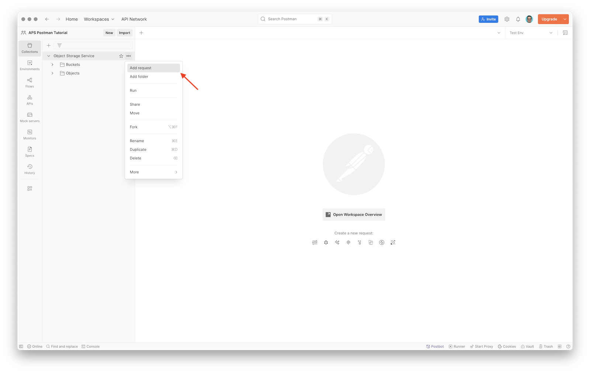

- Name the request `Get Next Page`, and set the endpoint to `{{nextPageUrl}}`
- The `{{nextPageUrl}}` value will turn red, indicating that the `nextPageUrl` has not been defined yet; click the value, open the **Add to** dropdown, and select **Collection**

> Note: The reason we use a variable here is because variables appear as inputs for the request in Postman Flows.

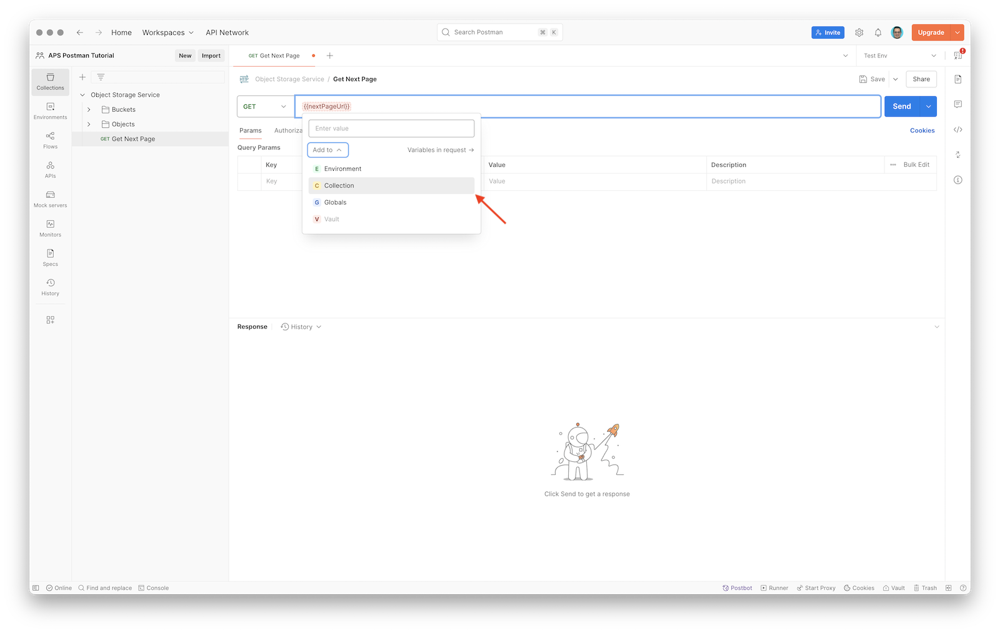

## Create flow

- In the left sidebar, switch to **Flows**, and click **Create flow module**

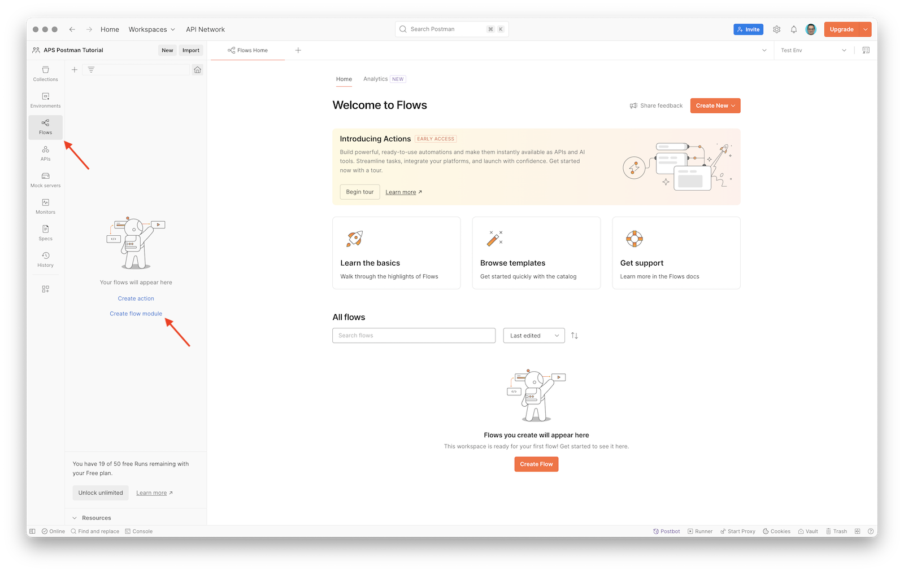

- Click the title at the top, and rename the flow to `List Buckets (OSS)`

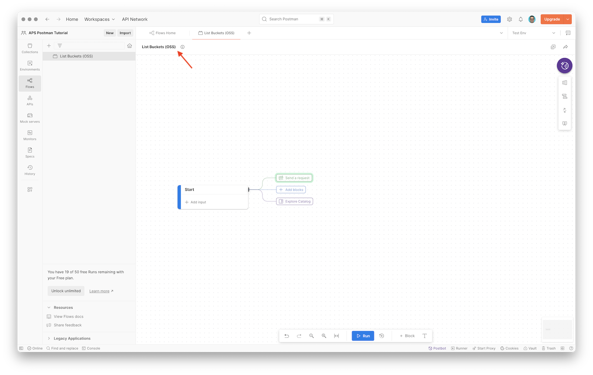

### List buckets

- In the flow canvas, click the green **Send a request** button to create a _request block_
- In the new **HTTP Request** block, click **Find or create new request**, and select the **GET List Buckets** request

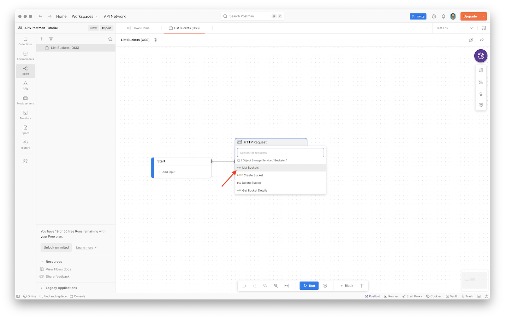

- Try and run the flow by clicking the **Run** button at the bottom of the canvas
- In the **List Buckets** block you should see a small orange dot next to the **Success** output; click the **Success** output to explore the actual response from the OSS API

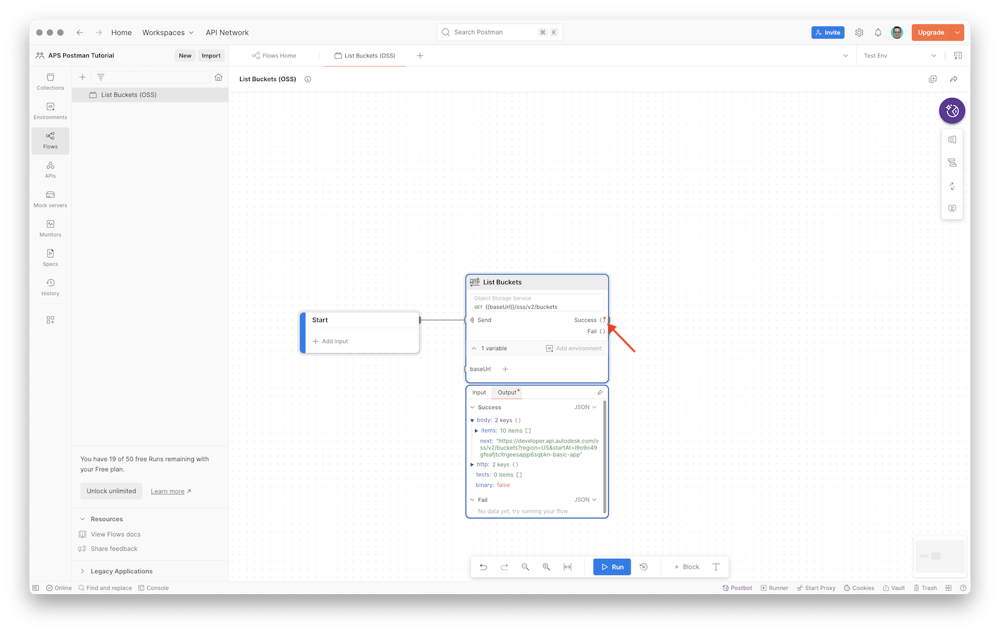

> Note: If the small orangee dot appears on the **Fail** output instead, it means the OSS API call failed; click the **Fail** output to inspect what went wrong.

- In the **List Buckets** block, grab the gray half-circle next to the **Success** output, drag and drop it on the canvas to create another block, and in the list of available blocks, pick **Select**

> Note: **Select** blocks are used to extract specific information from API responses.

- In the created **Select** block, click **Enter path...**, and specify the field this block should extract from the **List Buckets** response; you can either type in `body.items` manually, or (since we already ran our flow, and it remembers the last response) expand the response, and click on the `items` field there
- Create another **Select** block coming out of the **List Buckets** block like in the previous step, and this time, set the path to `body.next`

> Note: Another quick way to create **Select** blocks is by dragging the field names directly from _output previews_. In the video below, I click the **Success** output to preview the JSON response, and I can see that the JSON includes the **next** field (because I have more than 10 buckets). I can simply grab this field, and drag it outside the block.

[Pick outputs from list buckets request](images/list-buckets-pick-outputs.mp4 ':include :type=video controls width=100%')

### Check next page

Next we'll add a **Condition** block to check whether the `next` field is present in the response from the **List Buckets** block. We will connect both **Select** blocks created in the previous step (`body.items` and `body.next`) into the **Condition** block so that both of these values can be used in the rest of the flow.

- In the toolbar of the flow canvas, click **+ Block** to add a new block
- From the list of available blocks, select **Condition**, and place it on the canvas
- Make sure the block uses the TypeScript language for its expressions; you can select the language using the dropdown in the top-right corner of the block
- Connect the output of the **Select** block extracting `body.items` to the first input of the **Condition** block, double-click the input label, and rename it to `results`
- Similarly, connect the output of the **Select** block extracting `body.next` to the second input of the **Condition** block, double-click the input label, and rename it to `next`
- In the **Condition** block, rename the actual condition from `Condition 1` to `Has next page`, and enter the following expression for it:

```ts
!!next
```

> Note: All the inputs of the **Condition** block (in our case, `results` and `next`) will be available as fields of a record returned from each output of the block.

[Add next page check](images/add-next-page-condition.mp4 ':include :type=video controls width=100%')

- In the **Condition** block, grab the gray half-circle next to the **Default** output, and drag it outside the block; this part of the flow will be executed when none of the conditions match
- Create a new **Output** block, rename the connected input to `All Buckets`
- Note that the data coming into the **Output** block is a record with two fields, `results` and `next`, and in our case we only want to output the `results` field; instead of creating a separate **Select** block to pick just this one field, we can simply type `results` in the **Enter path...** field inside the **Output** block

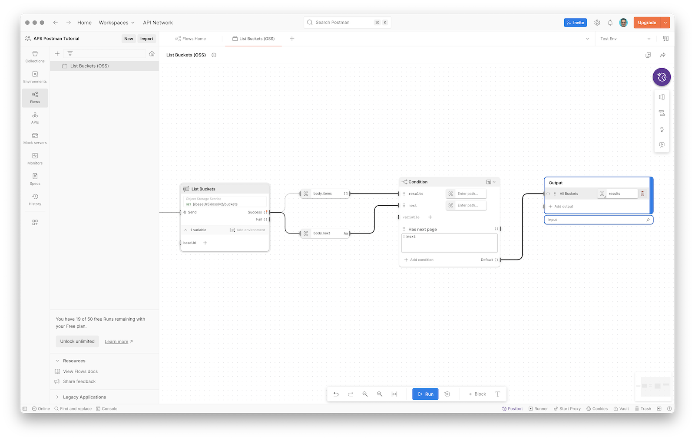

### Fetch next page

Now, let's extend our flow so that whenever there _is_ a next page of results, we fetch it, and repeat the process again.

- Add a new **HTTP Request** block, and choose the **Get Next Page** helper request we created earlier
- Connect the output of the **Has next page** condition in our **Condition** block to the input of the **Get Next Page** block
- As before, keep in mind that the data coming into the **Get Next Page** block is a record with two fields, `results` and `next`, and in this case we want the `next` field; type in `next` in the **Enter path...** field right next to the **nextPageUrl** input
- Try running the flow again (using the **Run** button in the canvas toolbar at the bottom), and if you have a larger number of buckets, you should see the flow hitting the **Get Next Page** block

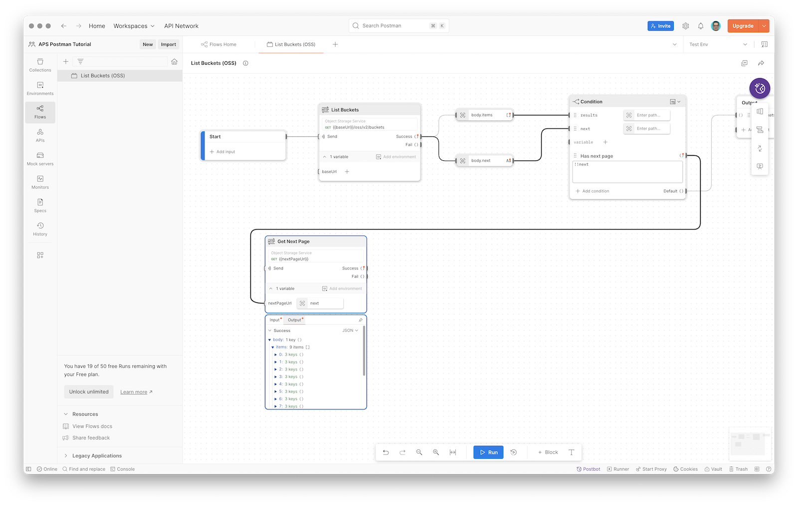

- Just like when adding the **List Buckets** block, let's extract the `items` and `next` fields from the output of the **Get Next Page** block
- Connect the **Select** block that extracts `body.next` to the **next** input of the **Condition** block

[Add next page check](images/get-next-page-pick-outputs.mp4 ':include :type=video controls width=100%')

### Concatenate results

Finally, whenever requesting additional pages of buckets, we will need to append these to the overall list of all buckets. We can do that using the **Evaluate** block that lets us execute custom TypeScript or [FQL](https://learning.postman.com/docs/postman-flows/flows-query-language/introduction-to-fql/) expressions.

- Use the **+ Block** button in the canvas toolbar, and add an **Evaluate** block
- Connect the **Select** block that extracts `body.items` from the **Get Next Page** block to the first input of the **Evaluate** block, and name it `items`
- Connect the output of the **Has next page** condition in our **Condition** block to the second input of the **Evaluate** block, and name it `results`
- Once again, the data coming out of the **Condition** block is a record with two fields, `results` and `next`, and in this case we only need the `results` field; click **Enter path...** next to the **results** input, and type in `results`
- Set the expression of the block to the following:

```ts
results.concat(items)
```

- Finally, connect the output of the **Evaluate** block back to the **results** input of the **Condition** block

[Add next page check](images/add-evaluate-block.mp4 ':include :type=video controls width=100%')

## Create snapshot

In order for this flow module to be reusable in other flows, we need to create a [snapshot](https://learning.postman.com/docs/postman-flows/build-flows/snapshots/) of its current state.

- Click the **Snapshots** button in the vertical toolbar in the top-right area of the flow canvas
- Click **Create Snapshot**

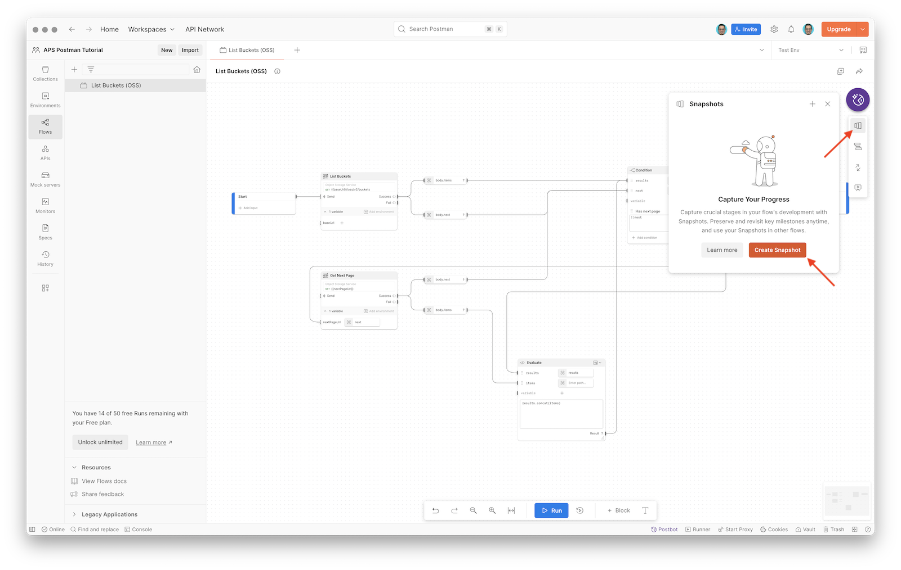

- Finally, in the **Snapshot 1** dialog, click **Create**, and wait for the flow snapshot to be saved

## Try it out

The complete flow should look similar to this:

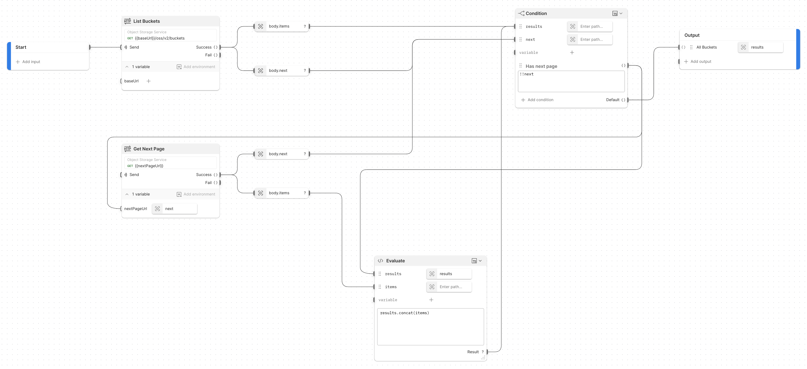

- Click the **Run** button in the toolbar at the bottom of the flow canvas
- After the flow has completed, select any of the blocks to open the preview of their inputs and outputs
- For example, after selecting the **Condition** block, we can see that - in case of my own application which currently contains 19 buckets - the **Has next page** output initially sent out the first 10 buckets together with the URL for the next page, and later the **Default** output sent out the complete list of 19 buckets

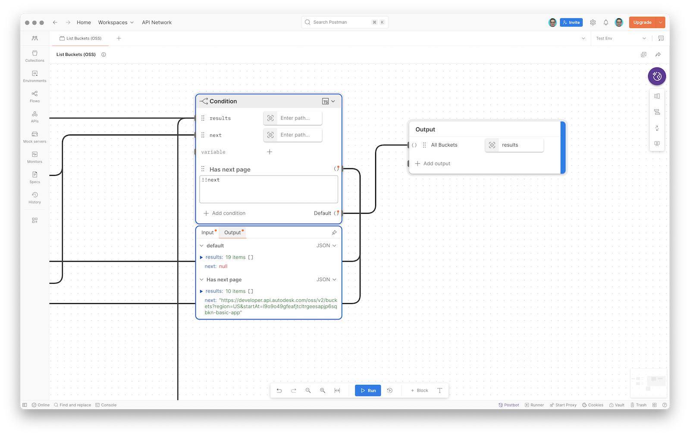