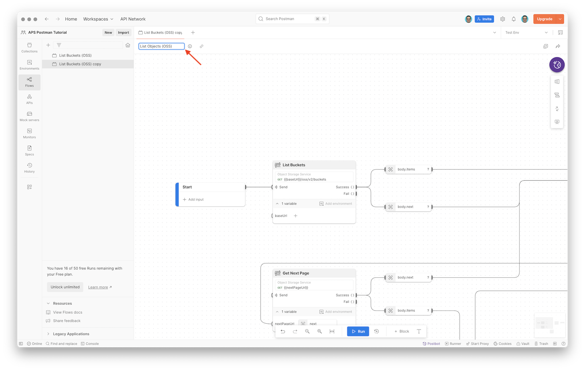

# Part 3: Objects Flow Module

In this part of the tutorial we will build another reusable [Flow Module](https://learning.postman.com/docs/postman-flows/build-flows/blocks/flow-module/), this time for listing all objects in a specific OSS bucket. Just like in the previous case, the flow will collect all paginated responses from the OSS API.

## Duplicate flow

Since both the [GET buckets](https://aps.autodesk.com/en/docs/data/v2/reference/http/buckets-GET/) endpoint and the [GET objects](https://aps.autodesk.com/en/docs/data/v2/reference/http/buckets-:bucketKey-objects-GET/) endpoint use the same pagination strategy, we can reuse most of the logic we created in the flow for listing OSS buckets.

- In the left sidebar, switch to **Flows**
- Click the three dots next to the **List Buckets (OSS)** flow we created earlier, and select **Clone**

- In the **Clone List Buckets (OSS)** popup dialog, click **Continue** to save the new flow in the same Postman workspace
- Click the title of the new flow, and rename it to `List Objects (OSS)`

## Modify flow

Now let's update the cloned flow so that it lists objects instead of buckets.

- In the **List Buckets** block, change the request from **GET List Buckets** to **GET List Objects**

Notice that the updated block now shows one more input - `bucketKey` - representing the OSS bucket for which we want to list the content. Let's make the bucket key a parameter of the entire flow module.

- In the **Start** block, click **+ Add input**
- Name the input `Bucket Key`, click the dropdown to the right of the input name, and select **String** as the input type
- Finally, connect this input to the **bucketKey** input of the **List Objects** block

- In the **Output** block, rename the single output to `All Objects`

## Create snapshot

In order to be able to reuse this flow module in other flows, we need to create a [snapshot](https://learning.postman.com/docs/postman-flows/build-flows/snapshots/).

- Click the **Snapshots** button in the vertical toolbar in the top-right area of the flow canvas
- Click **Create Snapshot**

- Finally, in the **Snapshot 1** dialog, click **Create**, and wait for the flow snapshot to be saved

## Try it out

The complete flow should look similar to this:

In order to run the flow we will need to provide a bucket key. In Postman Flows, inputs are provided via [scenarios](https://learning.postman.com/docs/postman-flows/build-flows/scenarios/).

- Click the **Run** button in the toolbar at the bottom of the flow canvas
- In the **Scenario 1** dialog that will appear, enter the key of the bucket you created in the first part of the tutorial, and click **Save**

- Click the **Run** button again to run the flow with the newly configured scenario
- Select the **Output** block, and in the preview that opens under it, explore the data that has arrived to this block

