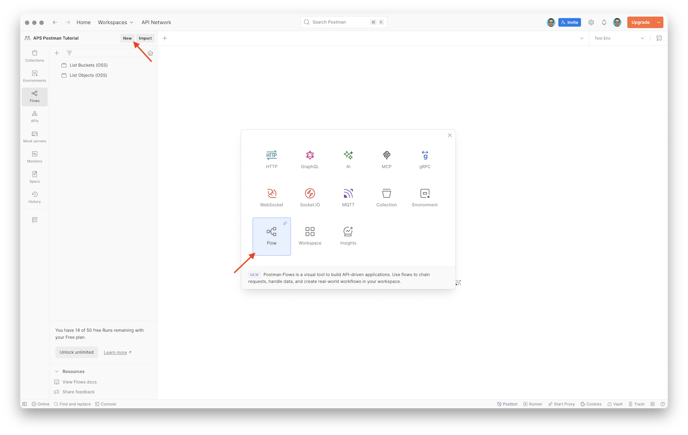
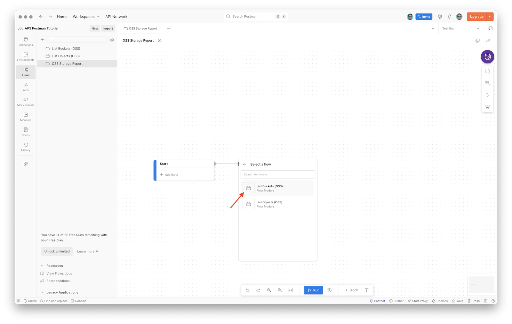
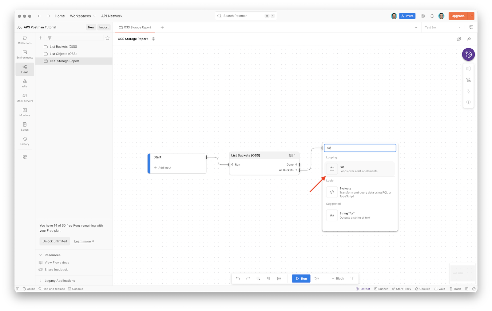
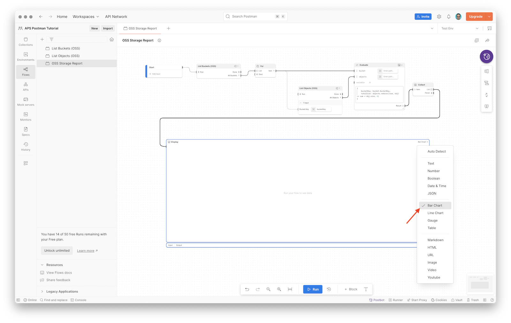
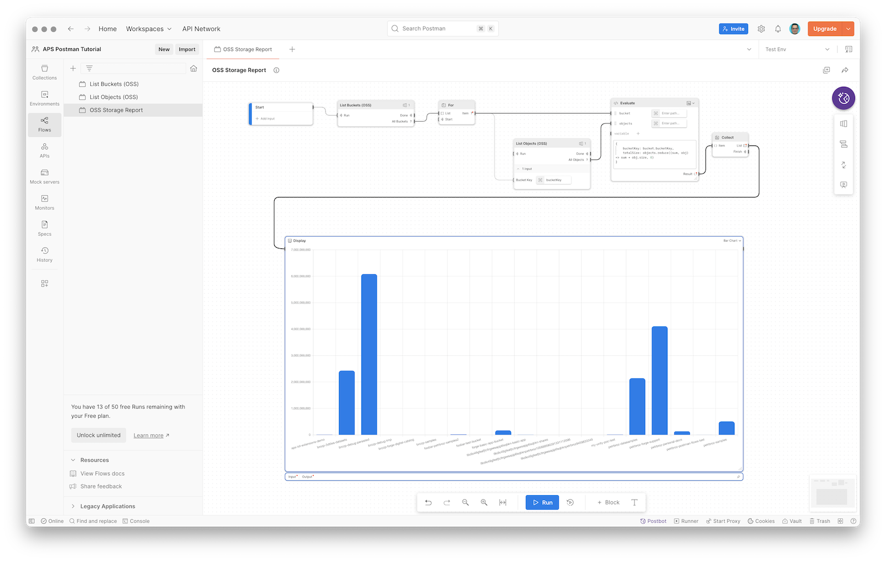

# Part 4: Example Flow

In this final part of the tutorial we will build a flow that will leverage the reusable flow modules we created earlier to generate a visual report of the storage usage in individual buckets owned by our application.

## Create flow

- In the left sidebar, switch to **Flows**, and click the **New** button at the top
- In the popup dialog, select **Flow**



- Rename the flow to `OSS Storage Report`

### Iterate over buckets

- In the flow canvas, click the **+ Add blocks** option next to the **Start** block
- In the list of available blocks, select **Flow Module**, and then **List Buckets (OSS)**

> Note: If your flow modules are not listed, try restarting Postman.



- In the **List Buckets** block, grab the **All Buckets** output, and connect it to a new **For** block



- Click the **+ Block** button in the toolbar at the bottom of the flow canvas, select **Flow Module** > **List Objects (OSS)**, and place the block next to the **For** block
- Connect the **Item** output of the **For** block to the **Bucket Key** input of the **List Objects (OSS)** block
- Remember that the **List Objects (OSS)** block will receive _records_ with details about individual buckets, but we only need the key of the bucket as the input; click **Enter path...** next to the **Bucket Key** input, and type in `bucketKey` to pick just this one field

[Add list objects module](images/add-list-objects-module.mp4 ':include :type=video controls width=100%')

### Calculate bucket size

Next, let's add a block that will calculate the sum of sizes of all objects in a specific bucket.

- Add an **Evaluate** block to the canvas
- Connect the **Item** output of the **For** block to the first input of the **Evaluate** block, double-click the input label, and rename it to `bucket`
- Connect the **All Objects** output of the **List Objects (OSS)** block with the second input of the **Evaluate** block, double-click the input label, and rename it to `objects`
- In the **Evaluate** block, enter the following TypeScript expression:

```ts
{
    bucketKey: bucket.bucketKey,
    totalSize: objects.reduce((sum, obj) => sum + obj.size, 0)
}
```

[Add evaluate block](images/add-evaluate-block.mp4 ':include :type=video controls width=100%')

### Display results

- In the **Evaluate** block, grab the **Result** output, and connect it to a new **Collect** block

> Note: **Collect** block will capture incoming data corresponding to individual items of an array emitted by the **For** block, and assemble them into a list again

- In the **Collect** block, grab the **List** output, and connect it to a new **Display** block
- In the **Display** block, click the **Text (Auto)** dropdown in the top-right corner, and set it to **Bar Chart**



## Try it out

- Click the **Run** button in the toolbar at the bottom of the flow canvas
- When the flow finishes, the **Display** block should show a bar chart, with each bar representing the total size of objects in a specific bucket

> Note: To test this flow thoroughly, consider creating more buckets, and uploading more files.

